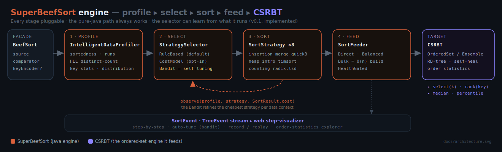
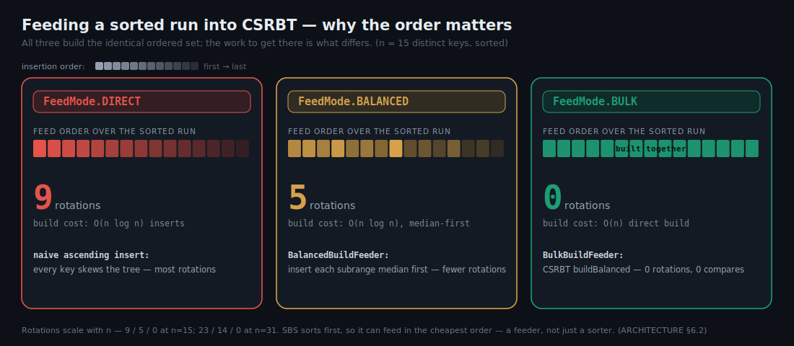
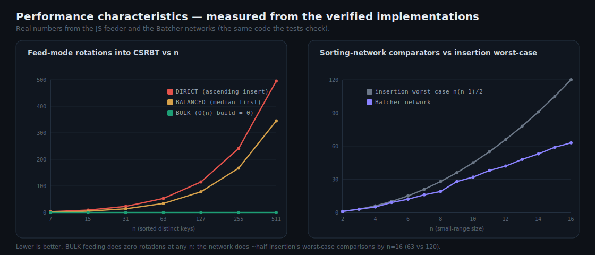
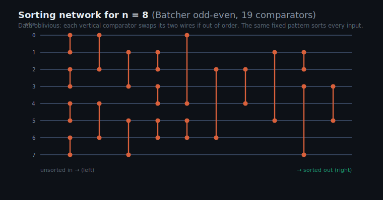

# SuperBeefSort

[](https://github.com/RicheyWorks/SuperBeefSort/actions/workflows/ci.yml)
[](LICENSE)
[](https://adoptium.net/)
[](https://gradle.org/)
[](https://github.com/RicheyWorks/CSRBT)
[](docs/ARCHITECTURE.md)

A polyglot, dual-domain, pluggable sorting **engine** that intelligently feeds
[CSRBT](https://github.com/RicheyWorks/CSRBT). It profiles the data, picks an algorithm and a
feeding personality, sorts, then builds into CSRBT's `OrderedSet` / `EnsembleOrderedSet` while
respecting its health gates and order statistics.

It's not a sorting library — it's an engine: **profile → select → sort → feed**, every stage
pluggable. And it's adaptive on both sides of that handoff: a streaming driver re-selects the sort
strategy when the data distribution drifts, and the sort's data profile primes CSRBT's own
tree-strategy adaptation. Java is the spine, and a dependency-free web step-visualizer ships today;
Rust kernels and a Python intelligence service are optional later-phase accelerators behind the same
interfaces.



**Docs:** [architecture & design](docs/ARCHITECTURE.md) · [CSRBT integration](docs/architecture-csrbt-integration.md) · [Phase 3 parallel-feed design](docs/PHASE3-PARALLEL-FEED.md) · [handoff notes](docs/HANDOFF.md) · [ideas backlog](docs/IDEAS.md) · [step visualizer](web/visualizer.html)

**Decision records (ADRs):** [Phase 4 — learned selection](docs/adr-phase4-python-intelligence.md) · [Phase 5 — observability & out-of-core scale](docs/adr-phase5-observability-scale.md) · [Phase 2 — Rust FFM kernel](docs/adr-phase2-rust-ffm-kernel.md) + [off-heap / rayon verdict](docs/adr-phase2-offheap-sortbuffer.md) · [CSRBT integration deepening](docs/adr-csrbt-integration-deepening.md) · [WikiSort block merge](docs/adr-wikisort-duplicate-block-merge.md) · [TimSort inversion galloping](docs/adr-timsort-inversion-galloping.md)

## Status

| Phase | Scope | State |
|-------|-------|-------|
| 0 | Pure-Java skeleton: pipeline, 6 comparison strategies, SPI registry, balanced + health-gated CSRBT feeders | ✅ done |
| 1 | Intelligence: HyperLogLog profiler, integer key stats + distribution, counting/LSD-radix sorts, capability-gated selection | ✅ done |
| 2 | Rust radix kernel via Panama FFM (Java fallback retained) | ✅ **productized** ([`sbs-kernels-rust/`](sbs-kernels-rust/)); off-heap buffer + rayon-parallel kernel explored and [**closed negative**](docs/adr-phase2-offheap-sortbuffer.md) — native radix only ties a JIT'd Java radix at scale, so it is **not** integrated and the Java path stays default |
| 3 | Ensemble **parallel mirror feed** (O(n)/member bulk-build) · **bounded streaming feed** with health backpressure · born-optimal CSRBT builds + adaptation | ✅ done |
| 4 | **Learned strategy selection**: an offline-trained decision tree over the `DataProfile` vector, exported to a dependency-free flat model and evaluated **in-process** behind a confidence + size gate, wrapping the cost-model delegate. **98.1% exact-match / 0.50% mean regret** vs the bandit's 65.4% / 191.94% on the held-out gate benchmark ([ADR](docs/adr-phase4-python-intelligence.md) · [trainer](tools/phase4/)). Optional gRPC service (4b) deferred — not needed for in-process inference | ✅ done |
| 5 | Out-of-core **external merge sort** (run-spill + k-way tournament merge, streams straight into CSRBT) · typed, versioned **step-event stream** (zero-cost when disabled) ([ADR](docs/adr-phase5-observability-scale.md)) | ✅ done |
| ✦ | **Shipped beyond the plan:** cost-model + self-tuning (bandit) selectors · branchless sorting-network kernel · precision feeder · run-aware profiling + **global inversion signal** · **learned (sample) sort** · **MSD radix** (string/byte keys) · **deterministic mode** · **differential + anti-quicksort chaos tests** · `SortReport` · JMH · CI · web step-visualizer with **self-contained record/replay** · **adaptive workload morphing** · **concept-drift adaptive streaming** (re-selects mid-stream) · **profile-guided co-optimization** (the sort primes the tree) · **entropy-aware LSD radix** (offset-by-min, adaptive base) · **stable in-place merge** (O(1) aux) · **WikiSort block merge** (`merge.wiki` — O(n log n) stable, O(1) aux, native duplicate handling) · **memory-aware selection** (declared `AuxMemory` + *measured* peak-aux metering, an opt-in auxiliary-memory budget across SMART/STABLE/facade, and a memory-weighted bandit cost) · **CSRBT ensemble promotion** (post-feed read-path migration via `EnsembleController` — an O(1) primary swap) · **post-feed adaptation observability** (`AdaptationReport`; "born-right ⇒ zero morphs" guardrail) · **Streams-API collectors** (`BeefCollectors`) | ✅ done |

## Build & test

Java 17+ and the bundled Gradle wrapper (Gradle 9.5.1). This is a **composite build** that pulls in
the sibling [`../CSRBT`](https://github.com/RicheyWorks/CSRBT) project automatically — clone both
side by side:

```bash
git clone https://github.com/RicheyWorks/CSRBT.git
git clone https://github.com/RicheyWorks/SuperBeefSort.git
cd SuperBeefSort
./gradlew build      # compiles SuperBeefSort + CSRBT, runs the test suite
./gradlew run        # demo: live pipeline trace + CSRBT order statistics
./gradlew jmh        # JMH benchmarks: strategies by data shape + bulk vs balanced feed
```

Then open **`web/visualizer.html`** in any browser for the step-by-step visualizer — profile → select →
sort → feed into a live red-black tree, with an **Auto-tune** panel that learns the cheapest
strategy per data shape, the profiler's **inversion** signal surfaced live, **record/replay** (compact
tokens *plus* self-contained capture files you can export/import to replay a recorded run verbatim), and a
live **CSRBT order-statistics** explorer (select / rank / median) on the built tree. No build step; pure
HTML/JS/SVG.

## Quick start

```java
import io.github.richeyworks.csrbt.OrderedSet;
import io.github.richeyworks.csrbt.strategy.RedBlackStrategy;
import io.github.richeyworks.superbeefsort.BeefSort;
import io.github.richeyworks.superbeefsort.core.KeyEncoder;
import io.github.richeyworks.superbeefsort.select.SelectionPolicy;
import java.util.Comparator;
import java.util.List;

OrderedSet<Integer> set = OrderedSet.withNaturalOrder(new RedBlackStrategy<Integer>());

BeefSort.with(Comparator.<Integer>naturalOrder())
        .source(List.of(9, 3, 7, 1, 8, 2, 5))
        .keyEncoder(KeyEncoder.ofInt(i -> i))   // unlocks linear-time counting / radix
        .policy(SelectionPolicy.SMART)          // profile, then choose the algorithm
        .observe(System.out::println)           // optional lifecycle events
        .feedInto(set);                         // sorted, balanced build into CSRBT
```

Without a `keyEncoder`, the engine behaves exactly like Phase 0 (comparison sorts only). Swap the
selection brain with `.selector(new BanditStrategySelector())` — it learns the cheapest strategy per
data shape across runs — or `.selector(new LearnedModelStrategySelector(SelectorModel.load(modelPath)))`
to drive selection with the offline-trained decision tree (it overrides the cost-model delegate only when
the model is confident and the input is past a size gate, and falls back to it otherwise); add
`.deterministic(seed)` for an exactly reproducible run (it seeds the
randomized quicksort pivot), cap the scratch a `SMART`/`STABLE` selection may use with
`.maxAuxMemory(bytes)` (it degrades to in-place sorts under memory pressure), and call
`SortReport.of(result)` for a one-line dashboard of comparisons, moves, **measured peak aux**, feed
time, and end-to-end throughput.

Beyond `feedInto(set)`, the facade offers other terminals: `buildOrderedSet()` / `buildEnsemble()`
construct a CSRBT target born-optimal in O(n); `buildCoOptimized(policy)` builds it born-optimal **and**
wired to adapt; `buildAdaptive(policy)` / `buildAdaptiveEnsemble(policy)` return the built set / ensemble
wired to CSRBT's control plane so it keeps re-tuning to live traffic — a single-tree morph, or an **O(1)
read-path promotion** across pre-built ensemble members; `streaming(set, maxSize)` does a bounded sliding-window feed; `adaptiveStream(set, maxSize)`
returns a drift-aware multi-batch driver; and `sortByteKeys(encoder)` runs the MSD radix over string /
byte-array keys. Once built, `OrderStats.of(set)` / `OrderStats.ofEnsemble(ensemble)` give a uniform
order-statistics view (`median`, `percentile`, `select` / `rank`, `rangeQuery`) — the payoff of feeding an
*ordered* structure, and the way to read those statistics off an ensemble (which exposes only the basics).
For inputs larger than RAM, `BeefSort.external(serializer).runSize(r).fanIn(f).feedInto(set)` runs an
**out-of-core merge sort** — it sorts fixed-size chunks with the full engine, spills them, then streams a
k-way tournament merge straight into CSRBT without ever materializing the whole input (stable under
`STABLE`). And from the Streams API,
`stream.collect(BeefCollectors.toOrderedSet(cmp, enc))` runs the whole pipeline as a sink — sequential
or parallel.

## The adaptive integration surface (2026-07)

The July 2026 audit (`docs/audit-csrbt-feeding-2026-07-07.md`) closed every gap between this
engine and CSRBT's adaptive machinery. The `BeefSort` facade now spans four tiers:

**Born optimal, wired to adapt.** `buildOrderedSet()` constructs in O(n) with the
profile-advised strategy (WRITE_HEAVY tunes `WeightBalanced(Δ,Γ)` from the measured
disorder). `buildAdaptive(policy)` / `buildCoOptimized(policy)` return a `WorkloadAdaptation`
whose `contains`/`add`/`remove` feed CSRBT's control plane *real* signals — realized search
depths and rotation deltas, one walk per op — and whose construction feed is the first
workload the scorer sees. `buildNavigableSet()` is the `TreeSet` drop-in flavor;
`buildOrderedSetPersisted(name, serializer)` ends the pipeline in a durable CSRBT snapshot
(reloads are health-gated on the CSRBT side).

**Ensembles, fully knobbed.** `buildEnsemble(spec)` / `buildAdaptiveEnsemble` /
`buildCoOptimizedEnsemble` compose member mixes via `EnsembleSpec` — VERIFIED quorum reads,
shadow modes, memory ceilings, member caps, and an automatic B+tree engine member above ~2M
profiled keys. Promotion is an O(1) primary swap; the bulk feed routes through the
adaptation's monitor. Bounded feeds (`STREAMING`, external merge) now target all-strategy
ensembles too: CSRBT's window fans out per member with uniform eviction, and genuinely
windowless mixes are rejected loudly, never fed silently unbounded.

**Drift reaches both engines.** `adaptiveStream(adaptation, maxSize)` couples the
`DriftDetector` to the tree: every fired verdict re-selects the *sort* strategy and hands the
*tree* one policy-gated `maybeAdapt()` — each behind its own anti-thrash gates.

**The evolution feed.** `buildEvolvingEnsemble(...)` runs CSRBT's evolution machine on live
traffic — a UCB1 bandit over the verified `WB(Δ,Γ)` box, or a (μ+λ) population bred across an
exact-shadow nursery — with births, gate-kills, and promotions streaming through
`TreeEventBridge` onto the same observer as the sort events. (Honesty clause inherited from
CSRBT's ADR-011: this tier is selection made observable, not a promised speedup.)

**See it run:** `./gradlew run --args="organism"` drives the whole organism — profile →
born-optimal set → three live regimes (read-heavy, hot-key skew, drifting bounded stream) —
and writes `docs/organism-session.json`, replayable in CSRBT's `demo/visualizer.html`.
**Or watch it live:** `./gradlew run --args="aquarium"` opens the tank at
`http://127.0.0.1:8077/` — an adaptive set swimming through an endless
[`Workloads.aquariumPlaylist`](src/main/java/io/github/richeyworks/superbeefsort/workload/Workloads.java)
(read-heavy → hot-key skew → write burst → windowed climb), every control-plane decision
streamed over SSE and the tree redrawn as it morphs — and a **DJ booth**: buttons that queue
any regime live (the driver switches within ~250 ops), so you can steer the workload and watch
the control plane react. The `workload` package is the menagerie: deterministic batch shapes
(nearly-sorted, reversed, sawtooth, duplicate-heavy, Zipf, jittered timestamps), adversaries
(organ pipe, zigzag, all-equal), string shapes for the MSD-radix path (shared-prefix paths,
UUIDs, zero-padded numerics, words), and live key streams/regimes for feeding either engine
anything you can name.
Benchmarks: `WindowedFeedBenchmark` prices the ensemble window (`./gradlew jmh`). Hardening
posture: `docs/hardening-audit-2026-07-08.md` (all findings remediated or documented).

## How it works

One pipeline, every stage pluggable:

| Stage | Component | Behavior |
|-------|-----------|----------|
| Profile | `IntelligentDataProfiler` | sortedness + longest run + a true **inversion count** (global disorder, exact or sampled), distinct-count (HyperLogLog), integer key stats, distribution; validates the encoder is order-faithful before trusting it |
| Select | `RuleBasedStrategySelector` (default) · opt-in `CostModelStrategySelector` · self-tuning `BanditStrategySelector` · offline-trained `LearnedModelStrategySelector` | capability/heuristic choice with a guaranteed introsort fallback; genuinely-few-inversion inputs route to adaptive insertion, and the cost-model/bandit can pick the learned sort — the bandit learns the cheapest per context from observed cost; the `LearnedModelStrategySelector` evaluates an offline-trained decision tree in-process and overrides the cost-model delegate only above a confidence + size gate; an optional auxiliary-memory budget steers selection toward in-place sorts under memory pressure |
| Sort | `SortStrategy` via `StrategyRegistry` (SPI) | sorting-network · insertion · merge · **in-place merge** (stable, O(1) aux) · **WikiSort block merge** (stable, O(1) aux, O(n log n), native duplicates) · 3-way quick · heap · intro · JDK · counting · **entropy-aware LSD radix** · **MSD radix** (string/byte keys) · **learned** (distribution-adaptive sample sort) |
| Feed | `SortFeeder` + `CsrbtTarget` | `BulkBuildFeeder` (O(n)) · `BalancedBuildFeeder` (median-first) · `HealthGatedFeeder` · `PrecisionFeeder` (validate-every-insert) · `ParallelFeeder` (mirror-ensemble fan-out) · `StreamingFeeder` (bounded sliding window) · `DirectFeeder` |

### Design notes

**Median-first feeding.** CSRBT exposes only `add(K)`. Inserting an already-sorted run naively is
`O(n log n)` and triggers many rotations, so `BalancedBuildFeeder` inserts the median of each
subrange first — an `O(n)`-ish balanced build that minimizes rotations. `HealthGatedFeeder` batches
it and calls CSRBT's `selfRepair()` between batches.



**Safe non-comparison sorts.** Counting/radix/learned need integer keys, supplied via a `KeyEncoder`.
The profiler samples the data to confirm the encoding agrees with the comparator's order; if it doesn't,
integer stats are withheld and the engine stays on comparison sorts — never silently reordering keys.

**Proven robust under attack.** Every strategy is differential-tested against the JDK reference across
pathological shapes (sorted, reversed, all-equal, sawtooth, organ-pipe, few-distinct). A Bentley–McIlroy
*median-of-three killer* then proves introsort's depth guard actually fires: on the same adversarial array
a plain (unguarded) quicksort goes quadratic (`> n²/5` comparisons) while the engine's introsort stays
sub-quadratic (`≤ 8·n·log₂n`) — and `.deterministic(seed)` makes any such run exactly reproducible.

**Adaptive on both sides of the handoff.** Beyond one-shot sorting, the engine adapts to a live workload.
`BeefSort.adaptiveStream(target, maxSize)` returns a driver that profiles each incoming batch and
re-selects the sort strategy *only* when a `DriftDetector` sees the data distribution shift — stable until
the data changes, never thrashing on batch-to-batch noise. On the CSRBT side, `buildOrderedSet()`
constructs the tree *born* in the profile-advised balancing strategy (`StrategyAdvisor`), and
`buildCoOptimized(policy)` goes further — it primes CSRBT's `MorphController` with a `ProfileGuidedScorer`
prior toward that strategy, so the sort's profile both shapes the tree at birth and seeds its adaptation,
which then defers to the live access pattern. Drift re-tunes the sort to the data; co-optimization lets the
sort teach the tree — the same anti-thrash idea (threshold/warmup/cooldown) on both sides. For a
multi-member target, `buildAdaptiveEnsemble(policy)` wires CSRBT's `EnsembleController` so the read path
*promotes* to whichever pre-built member matches live traffic — an O(1) primary swap, no rebuild — and both
adapters expose an `AdaptationReport`, which makes the design's *born-right ⇒ zero morphs* goal an
assertable test rather than a claim.

### Performance (measured)



Straight from the verified implementations: BULK feeding does **zero** rotations at any size (vs
DIRECT's roughly-linear growth), and the Batcher small-sort networks do about half insertion's
worst-case comparisons by n=16 (63 vs 120).

And here's what that small-sort kernel actually is — the verified Batcher network the engine runs for
small ranges (n=8 shown; the same data the `SortingNetworkTest` and 0/1-principle check validate):



## Adding a strategy

Implement `SortStrategy<K>`, then either register it on a `StrategyRegistry` or contribute a
`StrategyProvider` service
(`META-INF/services/io.github.richeyworks.superbeefsort.registry.StrategyProvider`) so it's
discovered on the classpath. The core never changes.

## Module map

```
src/main/java/io/github/richeyworks/superbeefsort/
├── core/      SortStrategy, SortBuffer (metered), KeyEncoder, ByteSequenceEncoder, SortContext, SortObserver, SortEvent, StepEvent, StepEventSink
├── profile/   IntelligentDataProfiler, Hll, DataProfile, KeyStats, Distribution
├── select/    StrategySelector · RuleBasedStrategySelector · CostModelStrategySelector · BanditStrategySelector (+ LearningStrategySelector) · SortPlan · SelectionPolicy
├── strategy/  SortingNetwork · Insertion · Merge · In-place Merge · WikiSort (merge.wiki) · Quick (3-way) · Heap · Intro · JDK · Counting · LSD Radix · MSD Radix · Learned
├── registry/  StrategyRegistry, StrategyProvider (SPI), BuiltinStrategyProvider
├── feed/      CsrbtTarget, FeedMode, BulkBuildFeeder, BalancedBuildFeeder, HealthGatedFeeder, PrecisionFeeder, ParallelFeeder, StreamingFeeder (+ HealthPolicy), DirectFeeder
├── csrbt/     AccessPolicy · StrategyAdvisor · EnsembleTargetFactory · WorkloadAdaptation · EnsembleAdaptation · ProfileGuidedScorer · AdaptationReport · EnsembleAdaptationReport   (born-optimal builds · co-optimized + ensemble adaptation · post-feed observability)
├── stream/    AdaptiveStreamSorter · DriftDetector · DriftSignal · DriftVerdict · StreamSortResult   (concept-drift streaming)
├── engine/    BeefSortEngine, JobSpec, SortRunResult, SortReport
├── BeefSort        fluent facade
└── BeefCollectors  Streams-API collectors (toOrderedSet / toSortedList)
```

Alongside `src/main`: `src/jmh/java/…/bench/` (JMH benchmarks), `src/test/java/…/` (JUnit + jqwik
suite — property, differential, anti-quicksort chaos, concept-drift, co-optimization, and MSD-radix
tests), and `web/visualizer.html` (the dependency-free step-visualizer).

## License

[MIT](LICENSE) © 2026 Richmond
