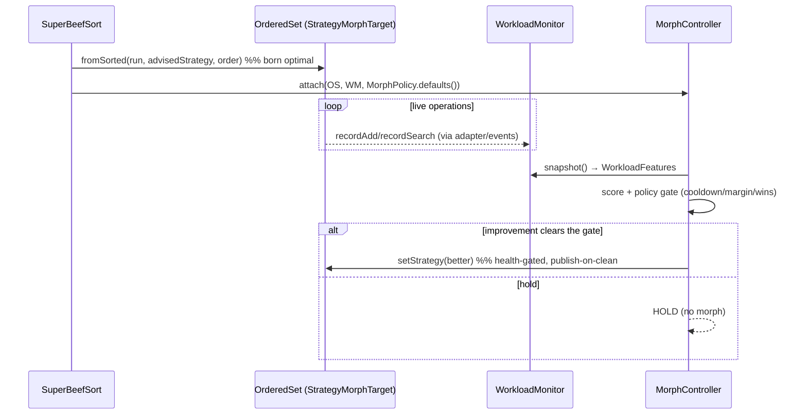

# Architecture — SuperBeefSort ↔ CSRBT integration

**Status:** Proposed · **Date:** 2026-06-16 · **Author:** Richmond (with Claude)
**Scope:** how SuperBeefSort (SBS) should consume the **CSRBT** public API at full strength. **CSRBT is
treated as a finished library — every API named here already exists; nothing in this document requires
changing CSRBT.** Companion to [`ARCHITECTURE.md`](ARCHITECTURE.md) §5.4 (feeders) and
[`PHASE3-PARALLEL-FEED.md`](PHASE3-PARALLEL-FEED.md).

---

## 0. What CSRBT actually exposes (the surface SBS should target)

The feed layer today mostly calls `add()` and the occasional `selfRepair()`. That uses a fraction of CSRBT.
The public surface SBS should be programming against:

### `OrderedSet<K>` (strategy-backed, `implements SelfHealingTree, OrderedCollection<K>, RankedSet<K>, StrategyMorphTarget<K>`)

| Capability | Method | Why SBS cares |
|---|---|---|
| **O(n) construct-from-sorted** | `static OrderedSet.fromSorted(asc, strategy, order)` · `fromSortedNatural(asc, strategy)` | Build a *new* set from a sorted, distinct run with **zero rotations** and a **chosen strategy** in one shot. |
| O(n) populate-empty | `void buildFromSorted(asc)` | Same, into an existing empty set. Validates strictly-ascending-distinct; throws otherwise. |
| **Health-gated morph** | `boolean setStrategy(TreeStrategy)` | Swap the balancing policy at runtime; candidate is built aside, validated by `StrategyHealthCheck`, published only on a clean pass. Same-policy is a no-op. Returns whether it applied. |
| Current policy | `TreeStrategy getStrategy()` | Read the installed strategy. |
| Self-heal | `boolean selfRepair()` | Defensive rebuild + validate; cheap when healthy, corrective when not. |
| Sliding window | `setMaxSize(n)` / `getMaxSize()` | Bounded-memory / streaming targets (FIFO eviction). |
| Augmentation | `setAugmentor(...)` / `getAugmentor()` | Interval/positional augmentation carried across morphs. |
| Order statistics | `select · rank · successor · predecessor · minimum · maximum · median · percentile · countInRange · rangeQuery` | The payoff of feeding an ordered structure — SBS can surface these post-feed. |
| Live metrics | `avgInsertTimeMs()` · `avgDeleteTimeMs()` | Feed back into selection / reporting. |
| Observability | `setEventListener(TreeEventListener)` | Watch `TreeEvent.Morph/Repair/Rotation` — drive `SortReport`, the visualizer, or a workload monitor. |

### Balancing strategies (`TreeStrategy<K>`, all health-validatable, parameter-aware via `samePolicyAs`)

| Strategy | Shape | Best when |
|---|---|---|
| `RedBlackStrategy` | balanced, ≤2× height, few rotations/write | **general default**, write-mixed |
| `AVLStrategy` | strict balance (bf ∈ {−1,0,1}) → shortest trees | **read-heavy / lookup-bound** |
| `SplayStrategy` | self-adjusting, splays accessed node to root, amortized O(log n) | **skewed access / hot keys / temporal locality** |
| `HybridStrategy` | AVL balance + RB color, self-instrumented | balanced + instrumented |
| `WeightBalancedStrategy(Δ)` | **parameterized** BB[α] | tunable: **large Δ → fewer rotations (write-heavy)**, **small Δ → shorter (read-heavy)** |

### `EnsembleOrderedSet<K>` (N-version, `implements OrderedCollection<K>`)

`builder(order)` → `.member(Supplier<TreeStrategy>)` · `.persistentMember()` (path-copying engine: **O(1)
snapshots**, wait-free readers) · `.engineMember(Supplier<RankedSet>, label)` · `.mode(EnsembleMode)`
(`MIRROR · VERIFIED · READ_REPLICA · SAMPLED_SHADOW · REBUILD_SHADOW`) · `.parallelFanOut()` ·
`.verifyEvery(n)` · `.maxMembers(k)` · `.shadowSampleRate(p)` · `.build()`. Reads are served by a
**primary**; writes fan out to all members. `buildAllFromSorted(asc)` bulk-loads every member.

### Control plane (workload-aware adaptation, all opt-in)

```
operations ──▶ WorkloadMonitor ──▶ WorkloadFeatures ──▶ StrategyScorer ──▶ MorphPolicy ──▶ MorphController
            recordAdd/Remove/Search   {readFraction,        CostModel       cooldown 4000,   .evaluateAndMaybeMorph(...)
                                        writeFraction,        StrategyScorer  20% margin,       → setStrategy() on the
                                        accessSkew,                           3 stability wins   OrderedSet (a StrategyMorphTarget)
                                        meanSearchDepth, …}
```

`OrderedSet` **is** a `StrategyMorphTarget`, so a `MorphController(orderedSet, monitor, scorer, policy)` — e.g.
`new MorphController<>(set, new RollingWorkloadMonitor(), new CostModelStrategyScorer(), MorphPolicy.defaults())` —
drives its `setStrategy(...)` under the anti-thrash `MorphPolicy`. `EnsembleController(ensemble, monitor)` does the
analogous thing for ensembles — `evaluateAndMaybePromote(...)` (which member serves) and `checkHealth()`
(failover / quarantine / heal / retire). The persistent engine (`PersistentRankedSet` /
`PersistentTreeEngine.snapshot()`) gives O(1) immutable snapshots and slots into an ensemble as an engine member.

---

## 1. Integration philosophy

Seven principles, in priority order.

1. **Construct, don't insert.** A sort run is *already* CSRBT's fast path's ideal input. Prefer
   `fromSorted` / `buildFromSorted` (O(n), zero rotations) over N× `add()` (O(n log n) + rotations) whenever
   the target is empty and the run is distinct-ascending. SBS already produces exactly that.
2. **Pick the structure from the profile, not by default.** SBS's profiler already classifies distribution,
   distinct-count, sortedness, and key stats. That, plus a declared/learned **access pattern**, should choose
   the *initial* `TreeStrategy` — so the tree is born optimal instead of being morphed into shape later.
3. **Build into the right shape to avoid morphs.** The cheapest morph is the one never needed. Choosing the
   strategy at construction (principle 2) means the control plane, if attached, mostly **HOLDs**.
4. **Respect the health gates — never bypass them.** `setStrategy` and `selfRepair` validate before they
   publish; that is a feature. SBS must route structural change *through* them and treat a `false` return as
   "kept the safe incumbent", never as an error to route around.
5. **Treat `EnsembleOrderedSet` as a first-class target**, not a fallback. It is the right answer for
   fault-tolerance, read-scaling, snapshot needs, and mixed read/write strategies — and a sorted run makes
   bulk-loading every member trivial.
6. **Order under CSRBT's comparator, always.** SBS must sort under *exactly* `target.comparator()`. A
   mismatch silently corrupts the tree — `CsrbtTarget` already captures the comparator for this reason; keep it.
7. **Hand the running tree to the control plane; don't reinvent it.** After the feed, attach a
   `WorkloadMonitor` + `MorphController` (or `EnsembleController`) so the structure keeps adapting to live
   access under CSRBT's own anti-thrash policy. SBS's job ends at "born optimal + wired to adapt".

---

## 2. Evolved feeder architecture

Today's feeders (`DirectFeeder`, `BalancedBuildFeeder`, `BulkBuildFeeder`, `HealthGatedFeeder`,
`PrecisionFeeder`, `ParallelFeeder`) share one shape: `FeedResult feed(List<K> sortedRun, CsrbtTarget<K>)`.
Keep that seam. Evolve **how** they use CSRBT, and add two integration seams (§6).

### 2.1 Construction path — `fromSorted` with a chosen strategy

The biggest under-utilization: `BulkBuildFeeder` only takes the `buildFromSorted` path when the target is an
*already-constructed empty* `OrderedSet`, and that set is whatever strategy the caller happened to build. The
evolved path lets SBS **own construction**:

```
profile + access policy ──▶ StrategyAdvisor ──▶ TreeStrategy
                                                     │
sorted distinct run ─────────────────────────────────┴─▶ OrderedSet.fromSorted(run, strategy, order)  // O(n)
```

So a new **`StrategyAwareBulkFeeder`** (or an option on `BulkBuildFeeder`) constructs the target itself when
the caller asks SBS to *produce* the set (`BeefSort….buildOrderedSet()`), choosing the strategy from the
profile. When the caller hands SBS an *existing* empty set, fall back to `buildFromSorted` on it (we don't get
to choose its strategy, but we still get O(n)) — and optionally a single post-build `setStrategy(advised)` if
the advised strategy differs and the morph is cheap on a freshly-built tree.

### 2.2 Incremental path — health-gated batching + `selfRepair`

For a **non-empty** target (you cannot `buildFromSorted` into it) or a **streaming** source, keep median-first
`add()` (the order that minimizes rotations — already in `BalancedBuildFeeder`) and gate health between
batches (`HealthGatedFeeder` → `selfRepair()`). `PrecisionFeeder` stays the validate-every-insert personality
for correctness-critical loads. These are correct as-is; the refinement is to **size batches against the
target's live metrics** (`avgInsertTimeMs()`) and to expose the health cadence as a policy (§7).

### 2.3 Streaming / bounded path — `setMaxSize`

For unbounded or memory-capped feeds, call `target` (`OrderedSet.setMaxSize(n)`) so CSRBT does FIFO eviction,
and feed in bounded batches with backpressure between them. This is the honest home for a `StreamingFeeder`
(distinct from `HealthGatedFeeder` only by the eviction bound + a backpressure hook).

### 2.4 Ensemble path

`ParallelFeeder` already prefers the O(n)/member `buildAllFromSorted` for an empty mirror ensemble and falls
back to median-first `add`. Extend the *targeting* (a member mix chosen from the profile — §4), not the feed
mechanics.

### Feeder responsibility matrix

| Feeder | Target precondition | CSRBT path | Cost |
|---|---|---|---|
| `StrategyAwareBulkFeeder` *(new)* | SBS constructs the set | `OrderedSet.fromSorted(run, advisedStrategy, order)` | O(n), 0 rotations |
| `BulkBuildFeeder` | empty `OrderedSet` | `buildFromSorted` (+ optional `setStrategy`) | O(n) |
| `BalancedBuildFeeder` | non-empty / unknown | median-first `add` | O(n log n) |
| `HealthGatedFeeder` | non-empty, correctness-aware | median-first `add` + `selfRepair` per batch | O(n log n) + checks |
| `PrecisionFeeder` | correctness-critical | `add` + validate every insert | slowest, safest |
| `StreamingFeeder` *(new)* | bounded / unbounded source | `setMaxSize` + batched `add` + backpressure | O(n log n), bounded heap |
| `ParallelFeeder` | empty mirror ensemble | `buildAllFromSorted` (parallel fan-out) | O(n)/member, overlapped |

---

## 3. Decision flow (post-Sort)

After the Sort stage produces a sorted run and the target's comparator/shape are known:

```mermaid
flowchart TD
    A[Sorted run + target] --> B{Target kind?}
    B -->|EnsembleOrderedSet| E{All members empty\n& MIRROR/VERIFIED?}
    E -->|yes| E1[ParallelFeeder → buildAllFromSorted\nO(n)/member, parallel fan-out]
    E -->|no| E2[median-first add\nfans out per ensemble mode]

    B -->|single OrderedSet / RankedSet| C{SBS owns construction?}
    C -->|yes, can choose strategy| D[StrategyAdvisor → strategy\nOrderedSet.fromSorted run, strategy, order]
    C -->|no, caller-supplied set| F{Set empty?}
    F -->|empty| G[buildFromSorted\n+ optional setStrategy advised]
    F -->|non-empty| H{Bounded / streaming?}
    H -->|yes| I[setMaxSize + StreamingFeeder\nbatched add + backpressure]
    H -->|no| J{Correctness-critical?}
    J -->|yes| K[PrecisionFeeder\nvalidate every insert]
    J -->|no| L[BalancedBuildFeeder / HealthGatedFeeder\nmedian-first add + periodic selfRepair]

    D --> M{Attach control plane?}
    G --> M
    E1 --> M
    M -->|adaptive workload| N[WorkloadMonitor + MorphController / EnsembleController]
    M -->|one-shot| O[done]
```

The single most important branch is **C → D**: when SBS owns construction, it builds *directly into the
profiler-advised strategy* in O(n). Everything else is graceful degradation toward `add()`.

### `StrategyAdvisor` — profile + access pattern → `TreeStrategy`

```
                            access pattern (declared or learned)
                  read-heavy        mixed            write-heavy      skewed / hot-key
 distribution ┌──────────────┬─────────────────┬──────────────────┬──────────────────┐
   uniform    │ AVL          │ RedBlack        │ WeightBalanced(Δ↑)│ Splay            │
   clustered  │ AVL          │ RedBlack        │ WeightBalanced(Δ↑)│ Splay            │
   skewed     │ WB(Δ↓)       │ RedBlack        │ WeightBalanced(Δ↑)│ Splay            │
   few-distinct│ AVL         │ RedBlack        │ RedBlack          │ Splay            │
             └──────────────┴─────────────────┴──────────────────┴──────────────────┘
```

The advisor is a pure function `(DataProfile, AccessPolicy) → TreeStrategy`; default `AccessPolicy = BALANCED`
yields `RedBlackStrategy`, so **the default behaviour is unchanged**. It only *adds* the ability to be smarter
when the caller declares intent.

---

## 4. Ensemble integration pattern

Prefer an ensemble when **any** of: reads must survive a member fault (availability), reads dominate and can
be scaled across differently-balanced members, an **O(1) snapshot** is needed (persistent member), or the
workload is genuinely mixed and one structure can't win. Otherwise a single `OrderedSet` is simpler and faster.

### Member composition (chosen from the profile)

```
EnsembleOrderedSet.builder(order)
  .member(RedBlackStrategy::new)        // primary: balanced, write-safe (serves first)
  .member(AVLStrategy::new)             // read-replica: shortest trees for lookups
  .persistentMember()                   // shadow: O(1) snapshots, wait-free point-in-time reads
  .mode(EnsembleMode.VERIFIED)          // quorum-verify reads when correctness > latency
  .parallelFanOut()                     // build members concurrently
  .build();
```

### Population

1. **Bulk** (empty, MIRROR/VERIFIED): `ParallelFeeder` → `buildAllFromSorted(distinctRun)` — every member
   built O(n), fan-out overlapped. (Measured ~36× over median-add in `EnsembleFeedBenchmark`.)
2. **Incremental / non-empty / shadow modes**: median-first `add()`; the ensemble's own executor and shadow
   policy (`SAMPLED_SHADOW` / `REBUILD_SHADOW`) govern which members see each write.

### Promotion (who serves)

Hand the ensemble to an `EnsembleController(ensemble, monitor)` and call `evaluateAndMaybePromote(opsElapsed)`
periodically. With a heterogeneous member set (RB + AVL + persistent), promotion lets the **read path migrate
to whichever member matches the live workload** (e.g. promote the AVL member when reads spike) — under the same
anti-thrash discipline as single-set morphing. SBS does **not** implement promotion; it composes the member set
and wires the controller.

### When ensemble beats single OrderedSet

| Need | Single `OrderedSet` | `EnsembleOrderedSet` |
|---|---|---|
| Lowest feed cost / memory | ✅ | ✗ (K× memory, K× build) |
| Read survives a member fault | ✗ | ✅ (failover) |
| O(1) snapshot / time-travel reads | ✗ | ✅ (`persistentMember`) |
| Read-scaling across shapes | ✗ | ✅ (promotion) |
| Mixed read/write, no single winner | partial (morph) | ✅ (per-member strategies) |

---

## 5. Health & morph awareness — working *with* CSRBT

CSRBT's correctness model is build-aside → validate → publish-on-clean. SBS should lean into it:

- **Make morphs rare by construction.** Principle 2/3: choose the strategy up front via `fromSorted`. A tree
  born in the right shape gives the `MorphPolicy` (4000-op cooldown, 20% improvement margin, 3 stability wins)
  nothing to do — the cheapest adaptation is none.
- **Route structural change through the gate.** Any SBS-initiated reshape is a `setStrategy(...)` call; a
  `false` return means CSRBT kept the validated incumbent. Treat that as success-with-no-change, log it, move
  on. Never reach past `getEngine()` to mutate raw nodes.
- **`selfRepair()` after risky feeds**, not on the hot path. A single `selfRepair()` after a non-bulk or
  externally-interrupted feed is a cheap "is this tree sound?" with a corrective rebuild if not — exactly what
  `HealthGatedFeeder` already does per batch.
- **Observe, don't poll.** Register a `TreeEventListener` to fold `TreeEvent.Morph/Repair/Rotation` into
  `SortReport` and the visualizer, instead of inferring health from outside.
- **Feed the monitor from the feed.** If adaptive, SBS (or a thin adapter) records each insert into the
  `WorkloadMonitor` (`recordAdd(keyHash, rotations)`); after the load, the `MorphController` evaluates against
  `WorkloadFeatures` and the workload-aware scorer. SBS supplies the *initial* strategy; the control plane owns
  *ongoing* adaptation. This division means SBS never thrashes the tree and never fights the policy.



---

## 6. Recommended package structure & classes

Keep `feed/` for feed *personalities*; add a small `csrbt/` package for the *integration policy* (the
"how to use CSRBT well" knowledge), so feeders stay thin.

```
superbeefsort/
├── feed/                         (existing seam: SortFeeder<K> + CsrbtTarget<K>)
│   ├── StrategyAwareBulkFeeder    NEW — constructs via OrderedSet.fromSorted(run, advisedStrategy, order)
│   ├── StreamingFeeder            NEW — setMaxSize + batched add + backpressure
│   ├── BulkBuildFeeder            (evolve: optional post-build setStrategy)
│   ├── BalancedBuildFeeder · HealthGatedFeeder · PrecisionFeeder · DirectFeeder · ParallelFeeder (as-is)
│   └── CsrbtTarget                (evolve: expose newOrderedSet(strategy), supportsMorph(), morphTo(strategy))
└── csrbt/                        NEW — CSRBT integration policy (no CSRBT changes)
    ├── StrategyAdvisor            (DataProfile, AccessPolicy) → TreeStrategy   [pure function]
    ├── AccessPolicy               enum/record: READ_HEAVY · WRITE_HEAVY · SKEWED · BALANCED (+ WB Δ knobs)
    ├── HealthPolicy               batch size, selfRepair cadence, validateEvery → drives feeders
    ├── EnsembleTargetFactory      profile → EnsembleOrderedSet.builder(...) member mix + mode
    └── WorkloadAdaptation         optional: wires WorkloadMonitor + MorphController/EnsembleController
```

`CsrbtTarget` already abstracts both `OrderedSet` and `EnsembleOrderedSet` and captures the comparator. The
additions are capability probes/factories (`newOrderedSet(strategy)`, `morphTo(strategy)`), mirroring the
existing `supportsBulkBuild()` / `supportsEnsembleBulkBuild()` style — so the engine's resolve path stays the
same and old callers are unaffected.

---

## 7. Proposed fluent API extensions (`BeefSort<K>`)

All additions are optional and default to today's behaviour.

| Method | Behaviour |
|---|---|
| `.accessPattern(AccessPolicy p)` | Declares expected access (READ_HEAVY / WRITE_HEAVY / SKEWED / BALANCED). Feeds `StrategyAdvisor`; default `BALANCED` → `RedBlackStrategy` (no change). |
| `.targetStrategy(Supplier<TreeStrategy<K>>)` | Explicit override of the advisor when the caller already knows. |
| `.buildOrderedSet()` *(terminal)* | SBS sorts **and constructs** the set via `OrderedSet.fromSorted(run, advisedStrategy, order)`, returning it — the "construct, don't insert" entry point. |
| `.feedIntoEnsemble(EnsembleOrderedSet<K>)` | First-class ensemble feed (today `feedInto` is overloaded; this makes intent explicit and selects `ParallelFeeder`). |
| `.buildEnsemble(EnsembleSpec)` *(terminal)* | SBS composes the member mix from the profile (`EnsembleTargetFactory`), builds, and bulk-loads it. |
| `.withHealthPolicy(HealthPolicy)` | Batch size + `selfRepair` cadence + `validateEvery` for the incremental/streaming feeders. |
| `.streaming(int maxSize)` | Calls `setMaxSize(maxSize)` on the target and routes to `StreamingFeeder`. |
| `.adaptWorkload(MorphPolicy)` | After the feed, attaches a `WorkloadMonitor` + `MorphController` (or `EnsembleController`) so the structure keeps adapting; default `MorphPolicy.defaults()`. |

Example — the full-strength path, still one fluent chain:

```java
OrderedSet<Long> set = BeefSort.with(Comparator.<Long>naturalOrder())
        .source(events)
        .keyEncoder(KeyEncoder.ofLong(e -> e))
        .accessPattern(AccessPolicy.READ_HEAVY)   // → StrategyAdvisor picks AVLStrategy
        .adaptWorkload(MorphPolicy.defaults())     // → control plane keeps it tuned
        .buildOrderedSet();                        // → OrderedSet.fromSorted(sorted, AVLStrategy, order), O(n)
```

---

## 8. Risks, guardrails & anti-patterns

| ❌ Anti-pattern | Why it's wrong | ✅ Instead |
|---|---|---|
| `add()`-ing a sorted run into an empty set | O(n log n) + rotations for data that supports O(n) zero-rotation build | `fromSorted` / `buildFromSorted` |
| Sorting under a comparator ≠ `target.comparator()` | Silently corrupts CSRBT's order — the worst class of bug | Always sort under `CsrbtTarget.comparator()` (already captured) |
| `buildFromSorted` on a non-empty or non-distinct/ascending run | Throws (`IllegalStateException` / `IllegalArgumentException`) | Dedup the run first; gate on `isEmpty()`; else take the `add` path |
| Treating `setStrategy(...) == false` as an error | It means CSRBT **kept the validated incumbent** — that's the safety feature working | Treat as no-op success; log; continue |
| Reaching past `getEngine()` to mutate nodes | Bypasses the lock + the health gate; breaks torn-read-freedom | Only mutate through the public API (`add`/`setStrategy`/`selfRepair`) |
| Repeated `setStrategy` to "tune" during a feed | Morph thrash — each morph is an O(n) rebuild | Choose the strategy **once** at construction; let the `MorphPolicy` gate any later change |
| Hand-rolling workload adaptation in SBS | Duplicates (and will diverge from) `MorphController` / `EnsembleController` | Compose CSRBT's control plane; don't reinvent it |
| Defaulting every target to an ensemble | K× memory and K× build for no benefit on simple loads | Ensemble only for availability / snapshots / read-scaling / mixed workloads (§4) |
| `selfRepair()` on the per-insert hot path | Turns each insert into an O(n) rebuild | One `selfRepair()` after a risky feed, or per batch in `HealthGatedFeeder` |
| Ignoring `EnsembleMode` when bulk-building | A wholesale `buildAllFromSorted` violates `SAMPLED_SHADOW`/`REBUILD_SHADOW` intent | Gate the bulk path to empty `MIRROR`/`VERIFIED`; else fall back to `add` (as `ParallelFeeder` does) |

---

## Appendix — rollout (incremental, each independently shippable)

1. `csrbt/StrategyAdvisor` + `AccessPolicy` (pure functions, unit-tested against the strategy table) and
   `CsrbtTarget.newOrderedSet(strategy)` — no behaviour change until a feeder uses them.
2. `StrategyAwareBulkFeeder` + `BeefSort.accessPattern/targetStrategy/buildOrderedSet`. Differential-test the
   produced set against the reference sort across strategies; assert `getStrategy()` matches the advice.
3. `EnsembleTargetFactory` + `buildEnsemble` + `feedIntoEnsemble`. Reuse `EnsembleParallelFeedTest`'s pattern.
4. `StreamingFeeder` + `setMaxSize` wiring + `withHealthPolicy`.
5. `WorkloadAdaptation` + `adaptWorkload` (attach `MorphController` / `EnsembleController`); a `TreeEventListener`
   that folds morph/repair events into `SortReport`. Benchmark that an advised-construction tree triggers **zero**
   morphs on a matching workload (the success metric for §5).

**Guiding metric:** the integration is "done well" when, on a workload matching the declared `AccessPolicy`,
SBS constructs the tree in O(n) **and the control plane HOLDs** — the structure was born right, so CSRBT never
has to morph it.
